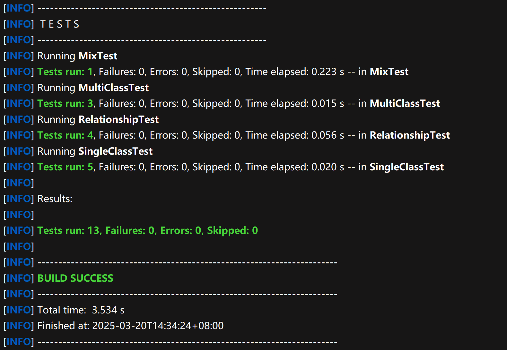
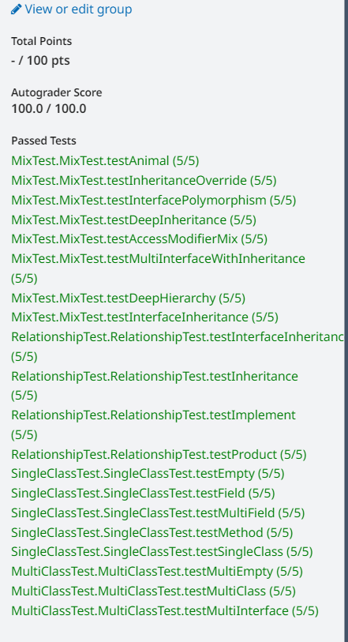

# JClassDiagram 迭代一设计文档

<center>第31组</center>

## 团队介绍

| 姓名   | 学号      | QQ 号      | 职责 |
| ------ | --------- | ---------- | ---- |
| 刘畅   | 221900071 | 1053432766 | 组长 |
| 梅天豪 | 221900056 | 2242974635 | 组员 |
| 潘智杰 | 221900313 | 3160400570 | 组员 |
| 庞鸿博 | 221900314 | 3231417980 | 组员 |

## 项目目标

设计并用Java代码实现一个 为Java代码自动生成plantUML类图的工具

## 系统设计

### 总体设计

- Diagram包:解析源代码并生成类图的plantUML语句
- Model包:负责定义和封装类、字段和方法的模型数据结构
- Utils包: 提供辅助工具函数

### 类设计


#### 设计模式

- **组合模式**:`ClassModel` 是一个复合对象，它由多个 `FieldModel` 和 `MethodModel` 组成。客户端在处理 `ClassModel` 时不需要关心它内部是如何组织字段和方法的。
- **模板方法模式**:`BaseModel` 类作为一个基类，提供了基本的框架和实现， `ClassModel`、`FieldModel` 和 `MethodModel` 继承 `BaseModel` 并实现了具体的细节

#### 弹性设计

- **模块化编程**:项目中每个包关注不同的职责，体现了模块化的设计思路。
- **面向接口编程**:`ClassModel`、`FieldModel` 和 `MethodModel` 类都继承自 `BaseModel`，这种设计允许其他类型的模型继承 `BaseModel`，而不破坏现有系统。


### 数据结构与算法设计

**代码解析**:系统使用 **JavaParser** 库来解析源代码,将 Java 源代码解析成抽象语法树(AST)。在解析过程中，源代码会被转换成 `CompilationUnit` 对象,作为AST的根节点。对于不同的数据模型，递归地传入对应的语法树节点。

**关系分析**:使用`ClassOrInterfaceDeclaration`的 getExtendedTypes与getImplementedTypes方法得到继承与依赖方法。

**结果输出**:目前采用StringBuilder,对于模型类覆写了ToString()方法。后续考虑在utils中添加新的输出工具类以统一输出模式。

**结果排序**:通过哈希表对优先级预先映射，按照

## 附录

### 实际工作安排

| 姓名   | 任务       | 备注 |
| ------ | ---------- | ---- |
| 刘畅   | 编码       |      |
| 梅天豪 | 编码       |      |
| 庞鸿博 | 设计与文档 |      |
| 潘智杰 | 调试与分析 |      |

### 运行结果

**Test运行结果**



**oj运行结果**



**运行实例**(以Animal.java为例)

```pseudocode
@startuml
class Animal {
    - name: String
    + {static} count: int
    + getName(): String
    + setName(name: String): void
}
class Dog {
    + gender: String
    + wolf(): void
}
class Bird {
    + color: String
    + fly(): void
}
interface Flyable {
    + fly(): void
}
Animal <|-- Dog
Animal <|-- Bird
Flyable <|.. Bird
@enduml
```

